# Money Hater — Trip Logger

Money Hater is a self-hosted trip logger that turns travel photos and receipts into a timeline of
places, expenses, and trips.

## Features

- Reconstructs daily stops from photo timestamps, EXIF data, and optional GPS coordinates.
- Matches coordinates to Google Places and analyzes photo content with OpenAI vision models.
- Extracts merchants, totals, and line items from receipts; manual expenses are supported too.
- Tracks spending in multiple currencies with user-confirmed exchange rates.
- Groups days into optional finished or ongoing trips.
- Suggests nearby places to visit while a trip is in progress.
- Supports photo sharing from compatible devices, offline app-shell access, and PWA installation.
- Includes responsive desktop and mobile layouts plus system-aware light and OLED-black themes.

## Screenshots

| Timeline | Trip | Expenses |
| --- | --- | --- |
| 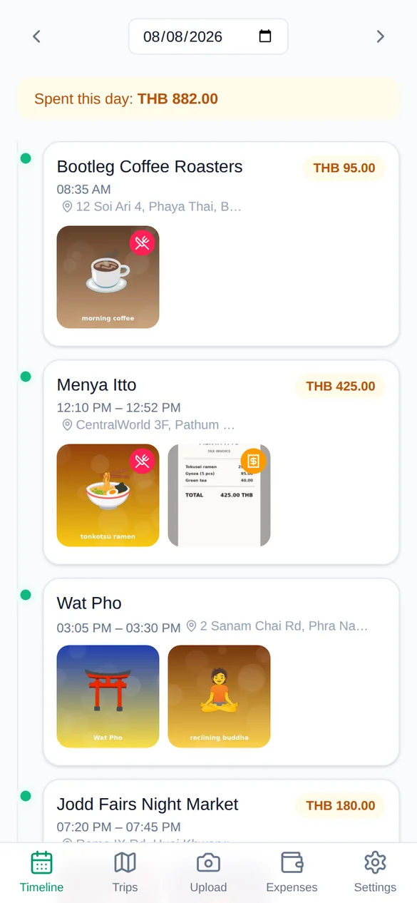 | 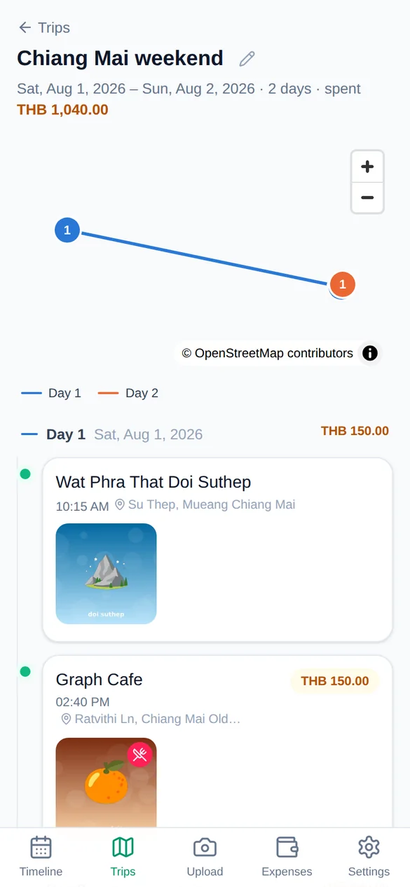 | 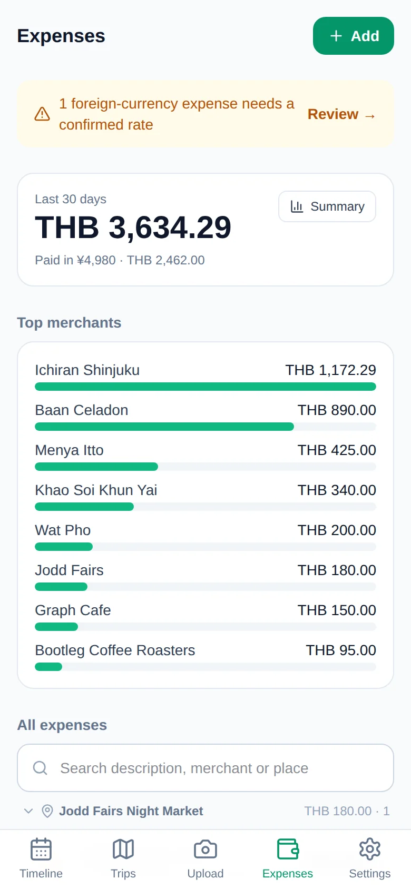 |

| Add expense | Confirm rate | Trip in progress |
| --- | --- | --- |
| 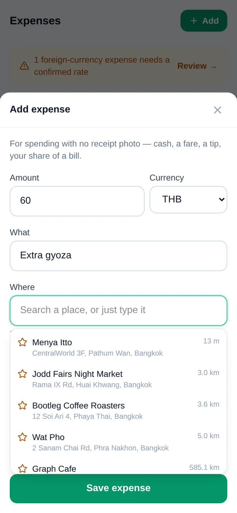 | 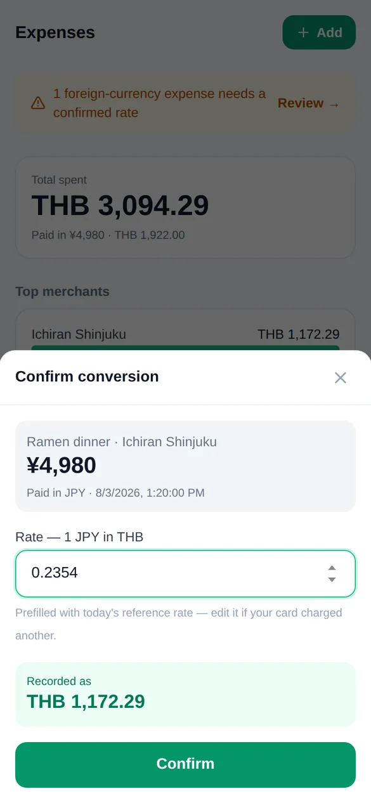 | 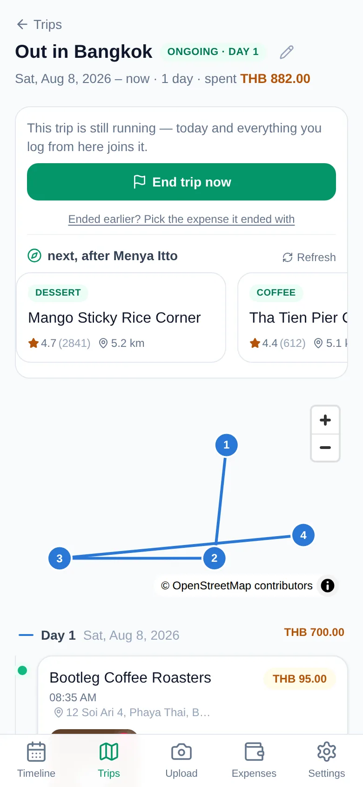 |

| Recommendation | Trips | Sign in |
| --- | --- | --- |
| 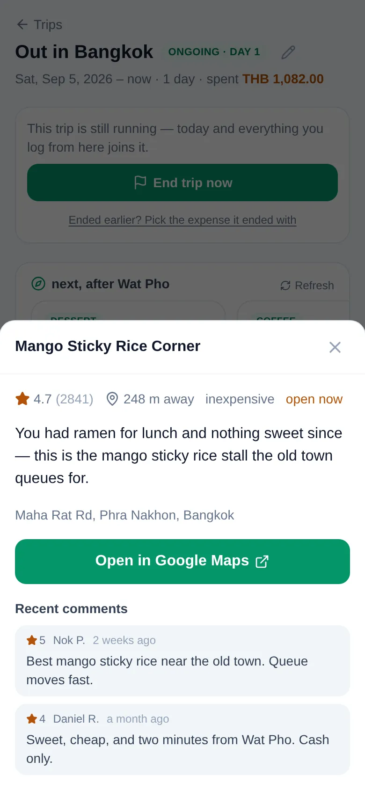 | 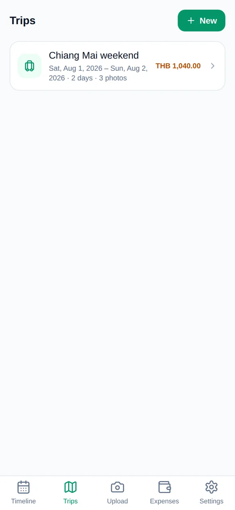 | 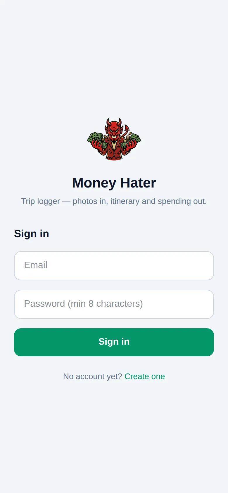 |

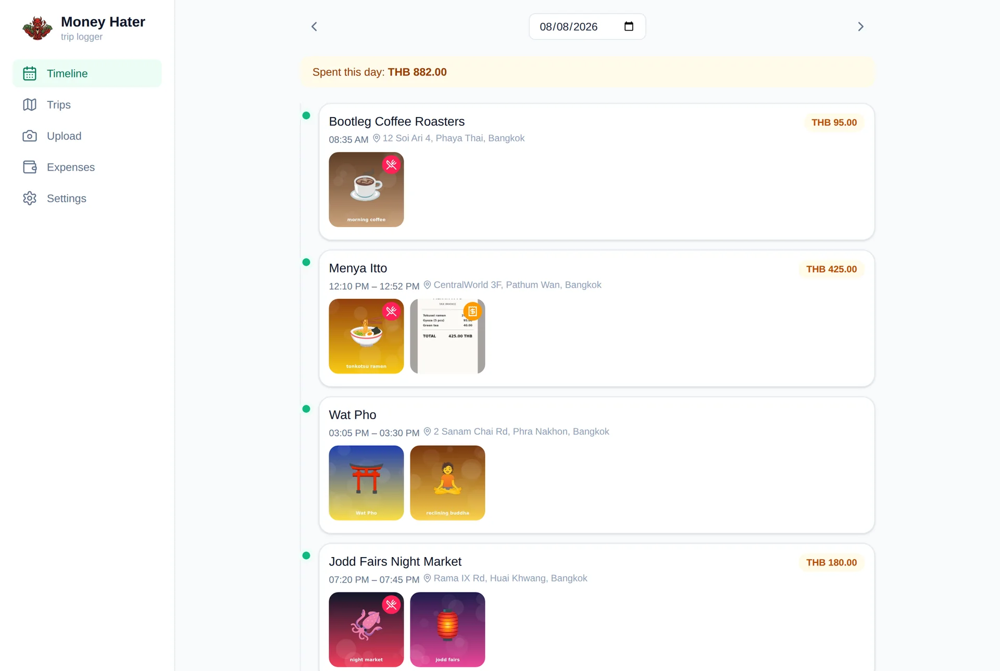

<details>
<summary>Dark mode</summary>

| Timeline | Trip | Expenses |
| --- | --- | --- |
| 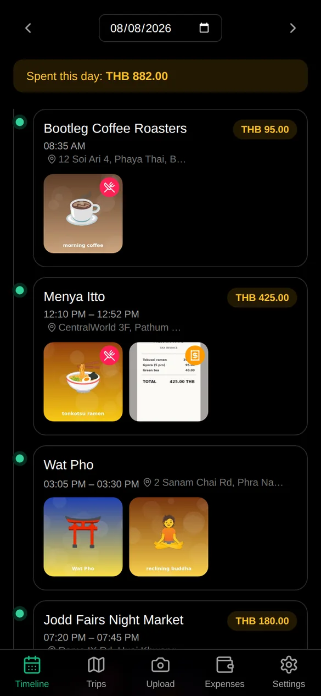 | 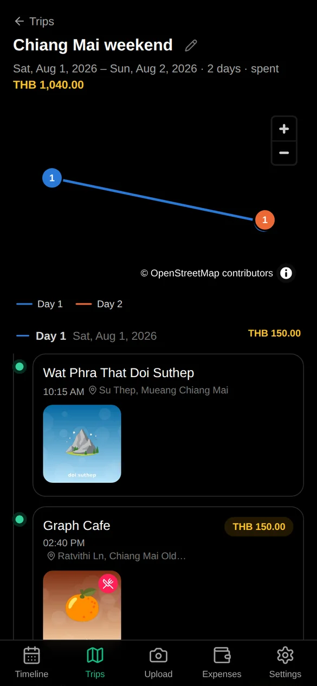 | 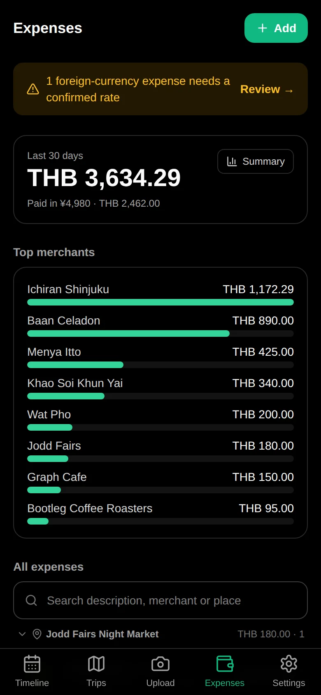 |

| Add expense | Confirm rate | Trip in progress |
| --- | --- | --- |
| 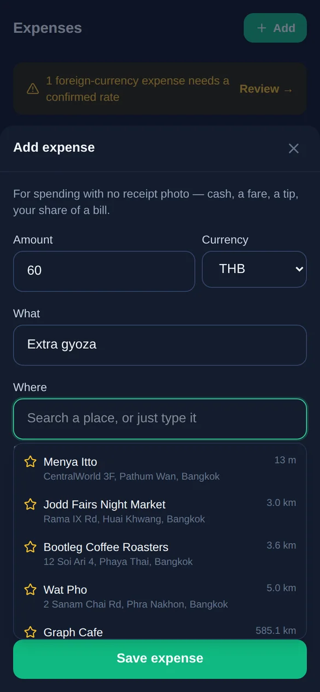 | 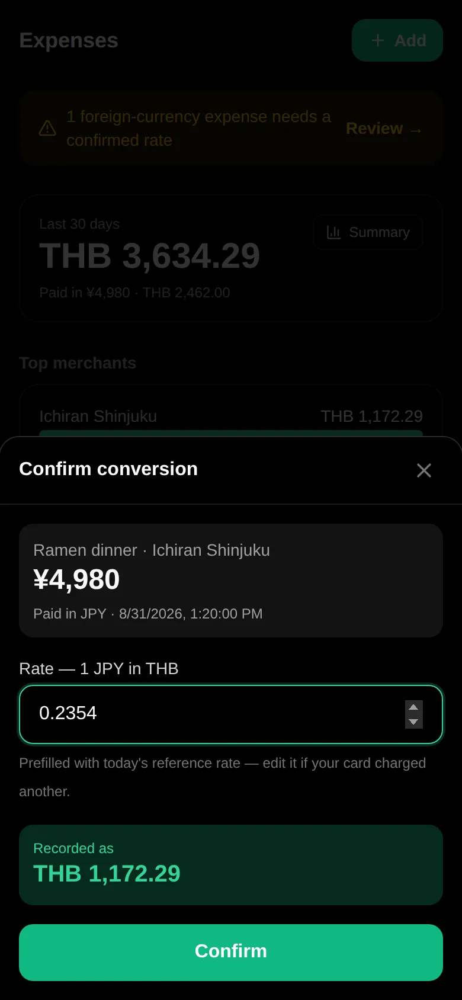 | 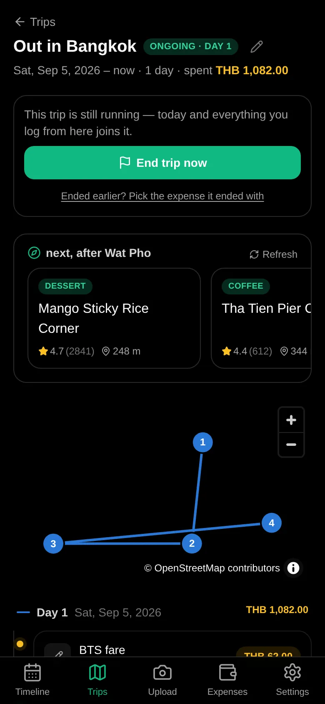 |

| Recommendation | Trips | Sign in |
| --- | --- | --- |
| 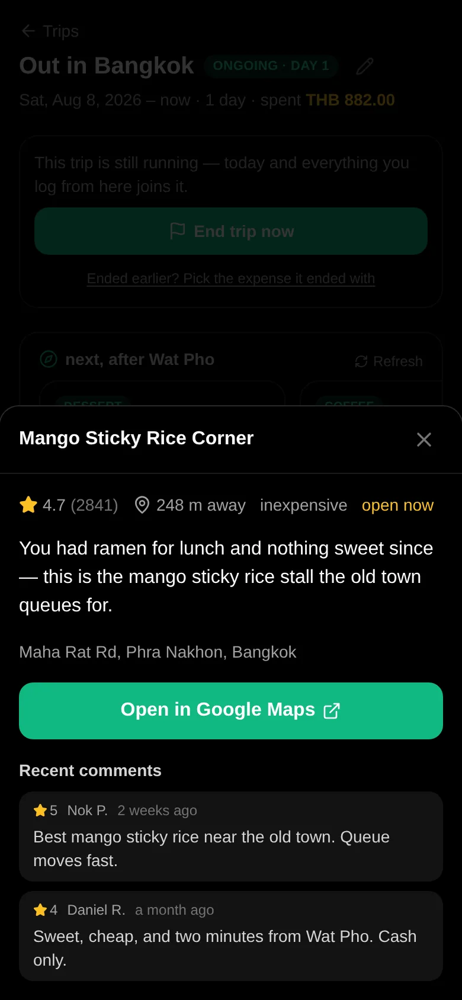 | 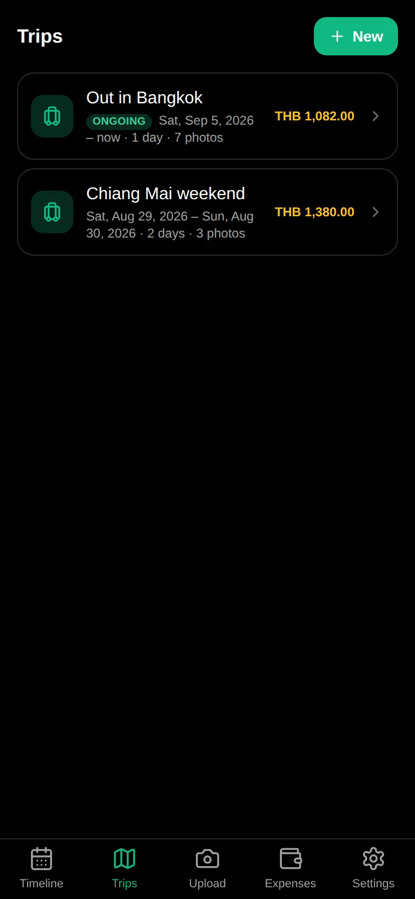 | 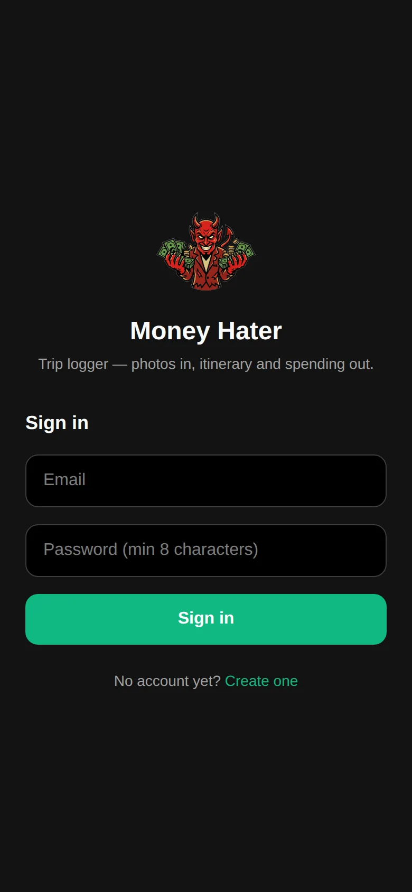 |

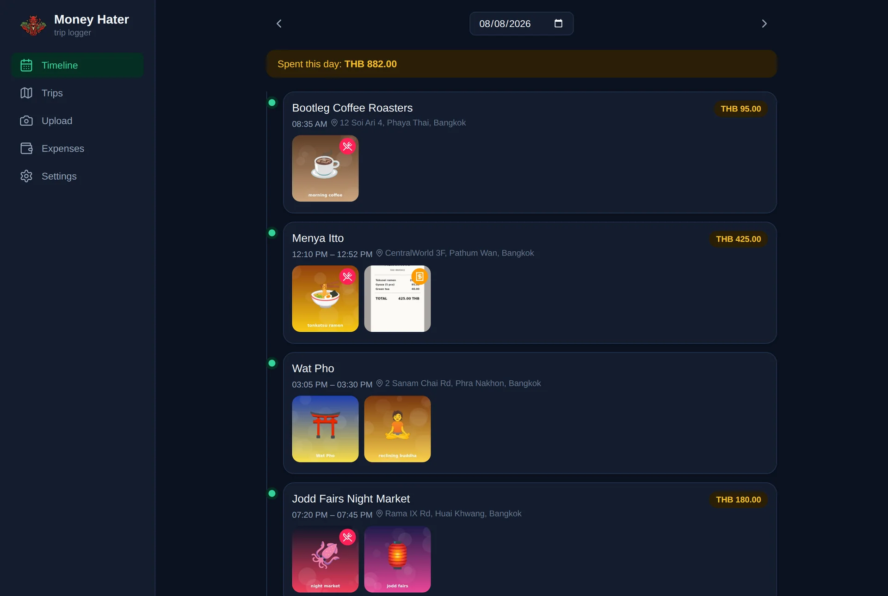

</details>

## Tech stack

- **Backend:** Python 3.11+, FastAPI, SQLAlchemy 2, Alembic
- **Jobs and data:** Procrastinate, PostgreSQL 17, filesystem image storage
- **AI and places:** OpenAI Agents SDK, Google Geocoding and Places APIs
- **Frontend:** React 19, TypeScript, Vite, TanStack Query, Tailwind CSS v4, MapLibre GL

## Local development

### Devcontainer (recommended)

Open the repository in VS Code and choose **Reopen in Container**. The container installs the
dependencies, starts PostgreSQL, applies migrations, and seeds the demo account.

```bash
# API — http://localhost:8000
cd backend && uv run uvicorn app.main:app --reload --host 0.0.0.0

# Worker
cd backend && uv run python -m app.worker.run

# Frontend — http://localhost:5173
cd frontend && npm run dev
```

Sign in with `demo@moneyhater.dev` / `demodemo123`. To recreate the demo data:

```bash
cd backend && uv run python -m app.dev.seed --reset
```

The seeder uses a known password and fabricated data; do not run it against a real environment.

### Docker Compose

```bash
cp .env.example .env
docker compose up --build
```

The frontend runs at <http://localhost:5173> and the API at <http://localhost:8000>. Add API keys
to `.env` to enable image analysis, place matching, and recommendations:

```bash
OPENAI_API_KEY=sk-…
LLM_MODEL=gpt-4.1-mini   # must support image input
GOOGLE_MAPS_API_KEY=…
```

`LLM_API_KEY` can override `OPENAI_API_KEY`. Without provider or Google Maps credentials, photos
are still organized by their available time and location metadata, but AI and place features are
limited. OpenAI SDK tracing is disabled by default.

## How it works

1. Uploaded images are deduplicated, stored under `MEDIA_ROOT`, and queued for processing.
2. The worker extracts timestamps and optional GPS data, creates thumbnails, and looks up places.
3. A vision model captions and classifies images and turns detected receipts into expenses.
4. Nearby images taken within a similar time window are clustered into stops and daily timelines.

Photos without GPS can join the nearest stop by time or be assigned a place manually. User edits
to dates, places, expenses, and stop names are preserved when the timeline is rebuilt.

Trips are optional ranges bounded by expenses. An ongoing trip has no end expense until it is
closed, and can use the current location, itinerary, local time, web search, and Google Places to
recommend a next stop.

## Tests and checks

```bash
cd backend && uv run pytest
cd backend && uv run ruff check .
cd frontend && npm run typecheck
cd frontend && npm test
cd frontend && npm run build
```

## Deployment

See [deploy/README.md](deploy/README.md) for the Kubernetes and CloudNativePG setup, or start from:

```bash
kubectl apply -k deploy/
```
